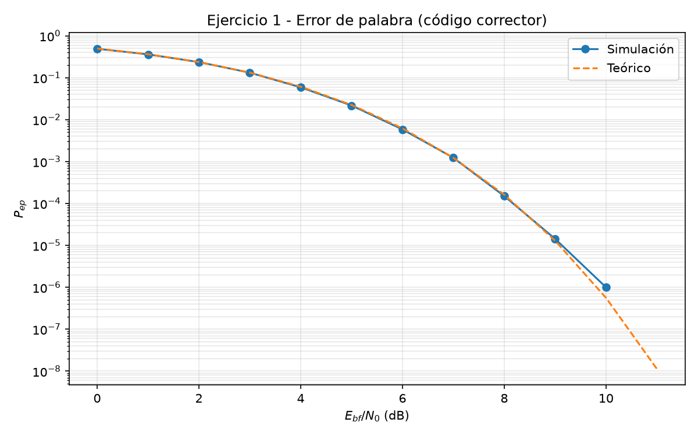
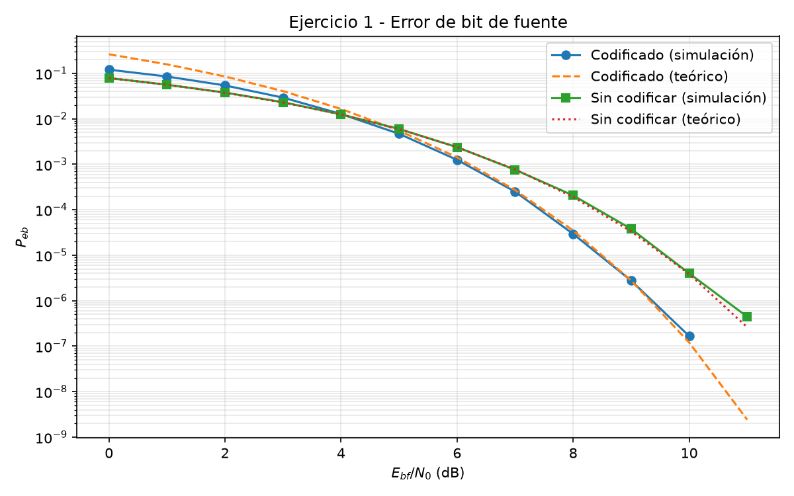
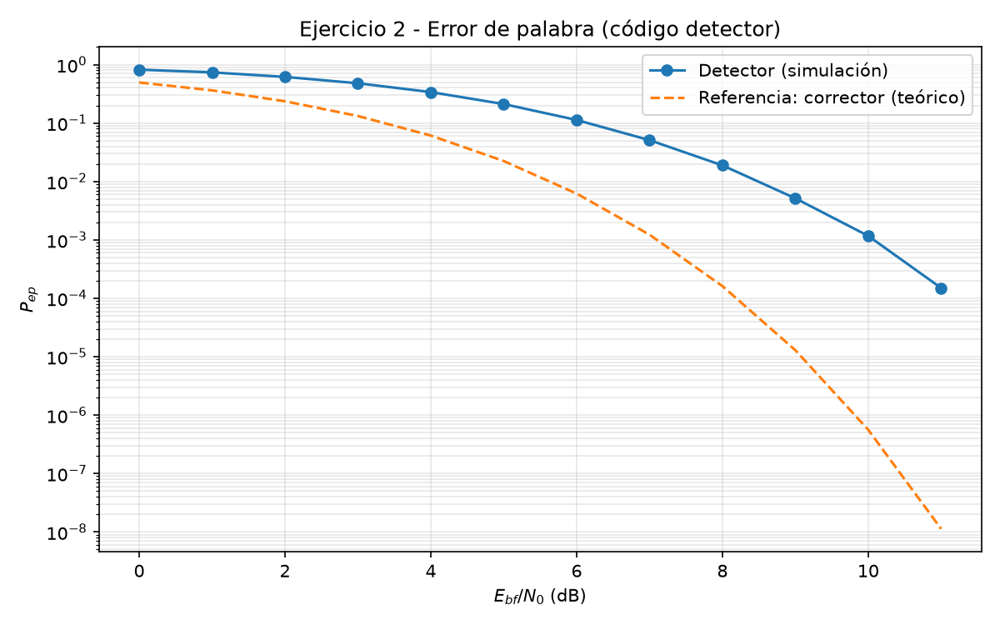
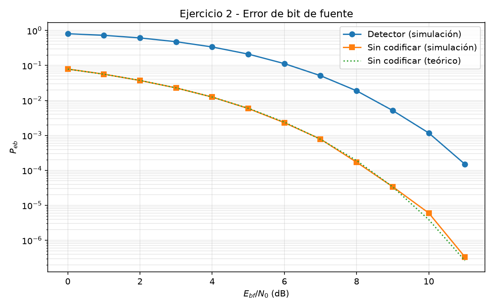
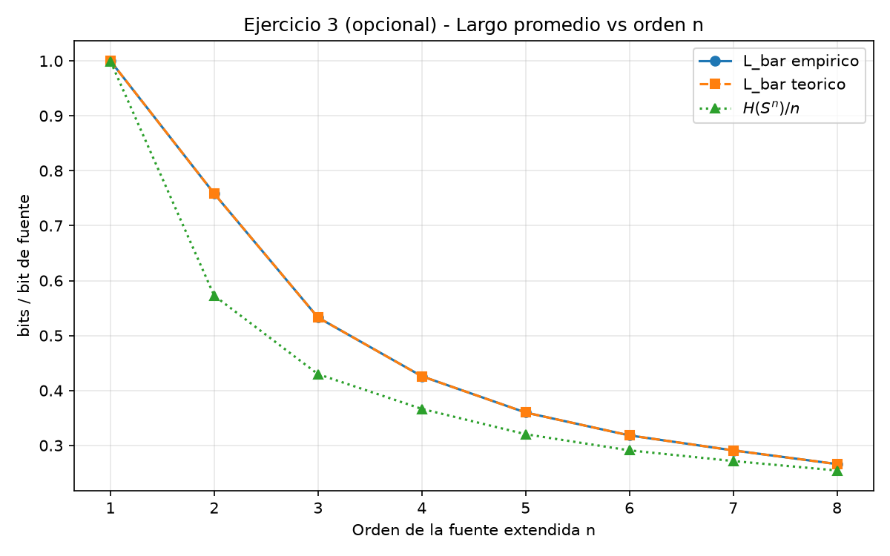
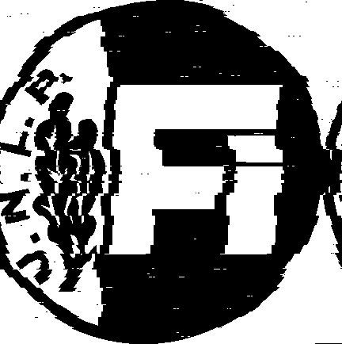

\begin{titlepage}
\centering

{\Huge \bfseries Trabajo Práctico de Simulación\par}
\vspace{0.25cm}
{\Large Codificación de fuente y canal\par}

\vspace{1cm}

{\large Ferreira Monteiro, Juan Cruz\par}
{\large 03476/3\par}

\vfill

{\large \textbf{Facultad de Ingeniería - UNLP}\par}
{\large Teoría de la Información y Codificación\par}

{\large 17 de junio de 2026\par}
\end{titlepage}

\renewcommand{\contentsname}{Índice}
\tableofcontents
\newpage

\pagenumbering{arabic}

# Introducción

## Contexto Teórico
### Codificación de Fuente

La codificación es la traducción de los símbolos de una fuente con un formato adecuado para su transmisión, por lo que entonces un símbolo $s_k$ perteneciente a una fuente $S = \{s_1, s_2, \dots, s_K\} \text{ con } P\{s_k\} = p_k$ quedará codificado en una secuencia de largo en bits $l_k$ (esta secuencia es denominada palabra), además el código será instantáneo o de prefijo si ninguna palabra de código es prefijo de otra. Dichos códigos cumplen el **Teorema de codificación de fuente de Shannon** el cual establece lo siguiente:

Dado $\bar{L} = \sum_{k=0}^{K-1} p_k l_k$ el largo promedio de la palabra de código, se cumple que 

$$
\bar{L} \ge H(S) 
$$

Donde $H(S)$ es la entropía de la fuente $S$ que es una medida de la incertidumbre asociada a la fuente $S$ [@proakis1995digital, p. 333], la misma se define matemáticamente como 

$$
H(S) = - \sum_{k=0}^{K-1} p_k \log_2(p_k) \quad \text{[bits/msj]}
$$

Por lo tanto el **Teorema de codificación de fuente de Shannon** nos da un límite a la compresión que puede realizarse usando un código instantáneo. Para acercarnos a este límite fundamental establecido por la entropía y lograr una compresión eficiente, utilizaremos el algoritmo de Huffman, este algoritmo es una codificación de longitud variable basada en la probabilidad de los símbolos de la fuente y consiste en sistematizar la idea de asignar longitudes de palabra menores a los símbolos más probables, el algoritmo es óptimo en el sentido de que el promedio de dígitos binarios requeridos para representar un símbolo es mínimo [@proakis1995digital, p. 342], sin embargo la eficiencia de esta codificación se ve limitada en el caso de que los símbolos sean equiprobables [@proakis1995digital]. En el caso particular del trabajo que se está desarrollando la fuente a codificar contiene píxeles negros y blancos con probabilidad de ocurrencia prácticamente iguales, para lograr eficiencia en estos casos se trabaja utilizando fuentes extendidas $S^n$, esta técnica consiste en agrupar bloques de longitud $n$ aprovechando las dependencias espaciales que pudieran existir entre píxeles.

### Codificación de Canal

Por otro lado, una vez que la información ha sido comprimida eficientemente, debe ser transmitida a través de un medio físico. Los canales prácticos de comunicación no son ideales e introducen perturbaciones, como el Ruido Blanco Gaussiano Aditivo (AWGN), que pueden alterar la amplitud de la señal y provocar errores en la recepción de los bits. Para combatir este fenómeno, se emplea la **codificación de canal**. A diferencia de la codificación de fuente, que busca eliminar redundancia, la codificación de canal introduce redundancia de manera estructurada y controlada para proteger el mensaje.

La base teórica de este proceso es el **Segundo Teorema de Shannon** (Teorema de codificación de canal), el cual establece que es posible transmitir información con una probabilidad de error arbitrariamente baja siempre que la tasa de transmisión no supere la capacidad del canal [@haykin2001communication]. 

Para llevar a la práctica este concepto, en el presente trabajo se implementará un código de bloque lineal denotado genéricamente como $(n, k)$. Específicamente, se diseñará un código sistemático $(14, 10)$, lo que significa que el mensaje original se divide en bloques de $k=10$ bits, a los cuales el codificador les agrega matemáticamente $n-k=4$ bits de paridad para formar una palabra de código de $n=14$ bits a transmitir.

Finalmente, el modelo del sistema a simular contempla que estas palabras de código sean moduladas utilizando BPSK (Binary Phase Shift Keying) y transmitidas por el canal AWGN. En el receptor, se aplicará una detección dura (hard-decision) sobre la señal ruidosa para decidir el valor binario de cada símbolo recibido, delegando al decodificador de canal la tarea de explotar la redundancia para detectar y corregir los posibles errores producidos durante la transmisión.

## Modelo del sistema

El modelo del sistema de comunicación a simular comprende una cadena completa de transmisión y recepción digital. En primer lugar, la fuente emite una secuencia de bits de información $b[n]$, los cuales asumen los valores 0 o 1 de forma equiprobable e independiente. Estos bits son procesados por el codificador de canal, el cual agrega redundancia estructurada mediante el código de bloque lineal $(14,10)$ previamente descripto.

Posteriormente, la secuencia binaria codificada es mapeada a símbolos utilizando una modulación BPSK (Binary Phase Shift Keying) antipodal. Para reducir la complejidad y el costo computacional de la simulación, se adopta un modelo equivalente de canal discreto a nivel de símbolo. Este enfoque permite prescindir de la simulación de la portadora pasabanda de alta frecuencia y de las etapas analógicas de filtrado. Asumiendo una recepción óptima con sincronismo perfecto de símbolo y portadora, la señal en el instante de muestreo $m$ queda definida exclusivamente por su componente en fase, y se modela matemáticamente como:

$$
y_I[m] = \alpha_m + n_I[m]
$$

Donde $\alpha_m$ representa la amplitud de la señal PAM en banda base transmitida (típicamente asociada a la energía del símbolo), y $n_I[m]$ es una variable aleatoria que representa una muestra de Ruido Blanco Gaussiano Aditivo (AWGN) en dicho instante.

Finalmente, en la etapa de recepción, se emplea un esquema de detección dura (hard-decision). El detector toma la muestra ruidosa $y_I[m]$ y la evalúa contra un umbral de decisión óptimo (cero, para el caso de BPSK antipodal) para emitir una estimación binaria $\hat{b}[n]$. Este flujo de bits estimado es entregado al decodificador de canal, cuya función será explotar la estructura del código $(14,10)$ para detectar y corregir los posibles errores introducidos por el entorno ruidoso.

# Codificación de canal: Desarrollo Analítico

## Definición del código

Para proveer al sistema de la capacidad de detectar y corregir errores, se diseñó un código de bloque lineal definido por los parámetros $(n, k) = (14, 10)$. Esto implica que por cada bloque de $k = 10$ bits de mensaje provenientes de la fuente, el codificador adiciona $q = n - k = 4$ bits de redundancia (o paridad), resultando en palabras de código de $n = 14$ bits de longitud.

Con el fin de simplificar la circuitería teórica del receptor y separar fácilmente la información útil de la redundancia, el código se implementó en su **forma sistemática**. Bajo esta convención, los primeros $k$ bits de la palabra de código corresponden exactamente al mensaje original, seguidos por los $q$ bits de paridad.

Matemáticamente, el proceso de codificación para un vector de mensaje $m$ se define mediante la **Matriz Generadora** $G$ de dimensiones $k \times n$, estructurada como la concatenación de una matriz identidad $I_k$ y una submatriz de paridad $P$:

$$
G = \left[ \begin{array}{c|c} I_{10} & P_{10 \times 4} \end{array} \right] =
\left[ \begin{array}{cccccccccc|cccc}
1 & 0 & 0 & 0 & 0 & 0 & 0 & 0 & 0 & 0 & 1 & 1 & 0 & 0 \\
0 & 1 & 0 & 0 & 0 & 0 & 0 & 0 & 0 & 0 & 1 & 0 & 1 & 0 \\
0 & 0 & 1 & 0 & 0 & 0 & 0 & 0 & 0 & 0 & 1 & 0 & 0 & 1 \\
0 & 0 & 0 & 1 & 0 & 0 & 0 & 0 & 0 & 0 & 0 & 1 & 0 & 1 \\
0 & 0 & 0 & 0 & 1 & 0 & 0 & 0 & 0 & 0 & 0 & 0 & 1 & 1 \\
0 & 0 & 0 & 0 & 0 & 1 & 0 & 0 & 0 & 0 & 1 & 1 & 1 & 0 \\
0 & 0 & 0 & 0 & 0 & 0 & 1 & 0 & 0 & 0 & 1 & 0 & 1 & 1 \\
0 & 0 & 0 & 0 & 0 & 0 & 0 & 1 & 0 & 0 & 0 & 1 & 1 & 1 \\
0 & 0 & 0 & 0 & 0 & 0 & 0 & 0 & 1 & 0 & 1 & 1 & 0 & 1 \\
0 & 0 & 0 & 0 & 0 & 0 & 0 & 0 & 0 & 1 & 1 & 1 & 1 & 1
\end{array} \right]
$$

De esta forma, cualquier palabra de código $c$ se obtiene mediante la operación algebraica en módulo 2: $c = m \cdot G$.

Por otro lado, para el proceso de detección y corrección de errores en el receptor, es fundamental definir la **Matriz de Control de Paridad** $H$, de dimensiones $q \times n$. Debido a la propiedad de ortogonalidad de los códigos de bloque lineales ($G \cdot H^T = 0$), la matriz $H$ se deriva directamente de $G$ de la siguiente manera:

$$
H = \left[ \begin{array}{c|c} P^T_{4 \times 10} & I_4 \end{array} \right] =
\left[ \begin{array}{cccccccccc|cccc}
1 & 1 & 1 & 0 & 0 & 1 & 1 & 0 & 1 & 1 & 1 & 0 & 0 & 0 \\
1 & 0 & 0 & 1 & 0 & 1 & 0 & 1 & 1 & 1 & 0 & 1 & 0 & 0 \\
0 & 1 & 0 & 0 & 1 & 1 & 1 & 1 & 0 & 1 & 0 & 0 & 1 & 0 \\
0 & 0 & 1 & 1 & 1 & 0 & 1 & 1 & 1 & 1 & 0 & 0 & 0 & 1
\end{array} \right]
$$

Cuando el receptor obtiene un vector ruidoso $r$ (que puede diferir de $c$ debido a los errores introducidos por el canal AWGN), calcula el **vector síndrome** $s$ mediante la ecuación:

$$
s = r \cdot H^T
$$

Si el síndrome resulta ser un vector nulo ($s = \mathbf{0}$), se asume que no ocurrieron errores o que el patrón de error es indetectable. Si $s \neq \mathbf{0}$, el valor específico del síndrome permitirá estimar el patrón de error más probable, un mecanismo que será explotado en las simulaciones posteriores.

## Capacidad de corrección y detección de errores

Para poder determinar la capacidad de corrección y detección de errores del código obtenido, primero debemos definir los conceptos de distancia y peso de Hamming. 

La distancia de Hamming entre dos palabras de código $c_1, c_2 \in C$, denotada como $d(c_1,c_2)$, es el número de componentes en los cuales $c_1$ y $c_2$ difieren. El peso de Hamming de una palabra de código $c \in C$, denotado como $w(c)$, es el número de componentes distintas de cero de dicha palabra. Para un código, la distancia mínima de Hamming será la mínima distancia entre todas las posibles distancias entre palabras de código distintas, y el peso por su parte será el mínimo peso entre todas las palabras de código [@proakis1995digital]. Especialmente en el caso de los códigos lineales se cumple que $d_{min} = w_{min}$, lo que nos permite definir el siguiente teorema:

Sea $C$ un código $(n, k)$ con matriz de verificación $H^T$: 

1. $\forall \bar{v} \in C$ de peso de Hamming $l, \quad \exists l$ filas de $H^T$ que suman cero.
2. Si $\exists l$ filas de $H^T$ que suman cero $\Rightarrow  \exists \bar{v} \in C / w_H(\bar{v}) = l$ 

$\therefore d_{min}$ está dada por la cantidad mínima de filas de $H^T$ que sumadas dan cero.

Dichas definiciones son extremadamente útiles ya que definimos la capacidad de detección de errores del código como:

$$
t_d = d_{min} - 1 
$$

Y la capacidad de corrección de errores como:

$$
t_c = \left\lfloor \frac{d_{min} - 1}{2}\right\rfloor
$$

En nuestro caso particular podemos ver que si sumamos las filas 1, 11 y 12 (cuyos valores son $[1, 1, 0, 0]$, $[1, 0, 0, 0]$ y $[0, 1, 0, 0]$ correspondientemente) obtenemos el vector nulo. Dado que no existen dos filas las cuales sumadas den cero (no hay filas repetidas), entonces $d_{min} = 3$. Por lo tanto, las capacidades de corrección y detección de errores serán $t_d = 2$ y $t_c = 1$.

Para validar la eficiencia de este diseño, se evalúa la **Cota de Hamming**, la cual establece el límite teórico máximo de errores $t_c$ que un código lineal $(n,k)$ puede corregir:

$$
2^{n-k} \ge \sum_{i=0}^{t_c} \binom{n}{i}
$$

Reemplazando los parámetros de nuestro sistema $(14, 10)$ y asumiendo $t_c=1$:

$$
2^{14-10} \ge \binom{14}{0} + \binom{14}{1} \implies 16 \ge 1 + 14 \implies 16 \ge 15
$$

Dado que la condición se cumple estrechamente para $t_c=1$, pero falla rotundamente para $t_c=2$ ($16 \not\ge 106$), se demuestra analíticamente que es imposible construir un código $(14,10)$ capaz de corregir más de un error. En conclusión, la matriz diseñada alcanza el límite teórico máximo, conformando un código óptimo.

## Desempeño teórico

Para evaluar la eficiencia real y la ganancia de codificación aportada por el diseño $(14, 10)$ propuesto, es indispensable establecer las expresiones analíticas que gobiernan el desempeño teórico del sistema. Esto nos permitirá contar con curvas de referencia exactas para contrastar y validar los resultados obtenidos mediante las simulaciones numéricas. En lo que sigue se adopta la notación del material de la cátedra: $P_{ep}$ denota la probabilidad de error de palabra de código, $P_{eb}$ la de bit de fuente, y los superíndices $(sc)$ y $(c)$ distinguen el sistema sin codificar del codificado con corrección de errores.

En primer lugar, se debe considerar el impacto de la introducción de bits de paridad sobre la energía de las señales transmitidas. Según el modelo del enunciado, si $E_s = A^2$ denota la energía de símbolo de canal y $E_{bf}$ la energía de bit de fuente, al mantener constante la potencia total del sistema se cumple la relación:

$$
E_{bf} = E_s \frac{n}{k} \quad \Leftrightarrow \quad E_s = E_{bc} = \frac{k}{n}\, E_{bf} = \frac{10}{14}\, E_{bf}
$$

donde $E_{bc}$ es la energía de bit de canal y, para BPSK binario, coincide con $E_s$.

Dado que el sistema implementa una modulación BPSK antipodal sobre un canal AWGN con un esquema de detección dura (hard-decision) en el receptor, el medio físico continuo se transforma equivalentemente en un Canal Simétrico Binario (CSB). La probabilidad de transición o de error de bit de canal ($p$) antes de ingresar al decodificador queda definida por la función $Q$ de Gauss:

$$
p = Q\left(\sqrt{\frac{2 E_s}{N_0}}\right) = Q\left(\sqrt{\frac{2 k}{n}\, \frac{E_{bf}}{N_0}}\right)
$$

Para el sistema de referencia **sin codificar**, la probabilidad de error de bit de fuente es la correspondiente a la modulación BPSK estándar indicada en el enunciado:

$$
P_{eb}^{(sc)} = Q\left(\sqrt{\frac{2 E_{bf}}{N_0}}\right)
$$

Para el **sistema codificado** en modo corrector, el decodificador de bloque lineal implementa una decodificación por distancia mínima acotada. Sabiendo que la capacidad de corrección del código es de exactamente $t_c = 1$ error por bloque, el sistema cometerá un error de palabra ($P_{ep}$) si el canal introduce $t_c + 1 = 2$ o más errores a lo largo de los $n=14$ bits transmitidos. Utilizando la distribución binomial, esta probabilidad se expresa como:

$$
P_{ep} = \sum_{i=t_c+1}^{n} \binom{n}{i} p^i (1-p)^{n-i} = \sum_{i=2}^{14} \binom{14}{i} p^i (1-p)^{14-i}
$$

A partir de la probabilidad de palabra, y considerando que para canales con baja probabilidad de error ($p \ll 1$) el evento dominante es aquel donde ocurren exactamente $t_c + 1$ errores, la probabilidad de error de bit de fuente post-decodificador ($P_{eb}^{(c)}$) se aproxima analíticamente tomando el primer término de la serie:

$$
P_{eb}^{(c)} \simeq \frac{2t_c + 1}{n} \binom{n}{t_c + 1} p^{t_c+1}
$$

Reemplazando por los parámetros de nuestro código ($n=14$, $t_c=1$), la aproximación teórica resulta en:

$$
P_{eb}^{(c)} \simeq \frac{3}{14} \binom{14}{2} p^2 = \frac{3}{14} \cdot 91 \cdot p^2
$$

Finalmente, un parámetro de diseño fundamental es la **Ganancia de Codificación Asintótica** ($G_a$), la cual predice la ventaja en potencia del sistema codificado frente al convencional cuando la relación señal a ruido tiende a infinito ($E_{bf}/N_0 \to \infty$). Para un esquema con detección dura (hard-decision), este límite se define en función de la tasa de código y la distancia mínima de Hamming ($d_{min}$) de la siguiente manera:

$$
G_a = \frac{k}{n} \left\lfloor \frac{d_{min} + 1}{2} \right\rfloor = \frac{10}{14} \left\lfloor \frac{3 + 1}{2} \right\rfloor = \frac{20}{14} \approx 1.4285
$$

Expresando este resultado en decibelios (dB), obtenemos la ganancia teórica máxima:

$$
G_{a\text{ (dB)}} = 10 \log_{10}(1.4285) \approx 1.55 \text{ dB}
$$

Este valor límite indica que, para escenarios de alta relación señal a ruido, el esquema codificado alcanza el mismo desempeño que el sistema sin codificar requiriendo aproximadamente $1.55 \text{ dB}$ menos de potencia.

# Simulación y Resultados

## Ejercicio 1 - Corrección de errores

### Metodología de simulación 

Para realizar la simulación del canal se implemento un script en Python que simula el flujo del mismo ajustándose a los scripts enviados por la cátedra en Matlab, además se implemento en código la codificación de canal desarrollada en la sección 2.1 y se la utilizo en modo corrector de errores. 

En primer lugar se implementó una matriz de mensajes (en la que cada fila de la misma se corresponde con un mensaje a enviar) basada en una fuente binaria equiprobable $S = \{0,1\} \text{con} P(0) = 0.5$, utilizando bloques de $k=10$. Dicha matriz es codificada utilizando la matriz generadora $G$ para agregar los 4 bits de paridad obteniendo una matriz $V$ definida de la forma $V = UG$, esta ultima matriz es enviada por el canal BPSK antipodal con ruido AWGN generando una matriz $R$ y es recibida utilizando detección dura, luego $R$ es corregida mediante el uso de $H^T$ y decodificada (que al usar forma sistémica, es quedarse con las primeras 10 columnas de cada fila) para obtener la matriz de salida $\hat{U}$.

Además se utilizo la misma matriz para pasarla a través de una canal sin codificar para tener como referencia, la probabilidad de error de bit de este caso se estima comparando los bits trasmitidos con los recibidos.

En ambos casos se utilizo $\frac{E_{bf}}{N0} \in [0 \text{dB}, 11 \text{dB}]$ utilizando pasos de $1 \text{dB}$. La probabilidad de error de palabra $P_{ep}$ se estimo comparando las filas de $U$ con las correspondientes en $\hat{U}$ y la probabilidad de error de bit $P_{eb}$ se estimo comparando la proporción de bits diferentes entre $U$ y $\hat{U}$. Dichas estimaciones si hicieron acumulando bloques hasta obtener suficientes errores adaptándose a los diferentes SNR.

Por ultimo se relevaron las correspondientes curvas teóricas mediante la implementación en código de las formulas mencionadas en la sección 2.2.

A continuación se presentan las curvas $P_{ep}$ y $P_{eb}$ generadas con dichas configuraciones. 

### Resultados: probabilidad de error de palabra
{#fig-ej1-pep width=90% fig-pos="H"}

En la @fig-ej1-pep se contrastan la probabilidad de error de palabra $P_{ep}$ obtenida por simulación y la curva teórica correspondiente al código corrector $(14,10)$. Para valores bajos de $E_{bf}/N_0$ la probabilidad de palabra errada es elevada, al incrementar la relación señal–ruido disminuye de forma marcada, con un cambio de pendiente notable entre $6$ y $8$ dB. La superposición de ambas curvas indica buen acuerdo entre el modelo analítico de la Sección 2.2 y la implementación simulada.

Dicho comportamiento es coherente con la capacidad de corrección $t_c=1$: una palabra solo se declara errónea si se producen al menos dos errores de canal en los $n=14$ bits transmitidos. En el régimen $p \ll 1$, la expresión binomial de $P_{ep}$ queda dominada por el término $\binom{14}{2}p^2$, de modo que la probabilidad de palabra escala aproximadamente con el cuadrado de la probabilidad de error por bit de canal $p$. Al aumentar $E_{bf}/N_0$, el parámetro $p$ decrece según el modelo CSB y, al estar $P_{ep}$ ligada a $p^2$, la representación en escala logarítmica exhibe una caída abrupta cuando $p$ atraviesa la zona umbral, esto explica la pendiente pronunciada observada en el rango indicado.

### Resultados: probabilidad de error de bit

{#fig-ej1-peb width=90% fig-pos="H"}

En la @fig-ej1-peb se presentan cuatro curvas: la probabilidad de error de bit de fuente post-decodificación $P_{eb}^{(c)}$, estimada por simulación y mediante la aproximación teórica de la Sección 2.2, y la probabilidad de error de bit del sistema de referencia sin codificar $P_{eb}^{(sc)}$, también en sus versiones simulada y teórica. Para un mismo valor de $E_{bf}/N_0$, el esquema codificado con corrección exhibe una probabilidad de error de bit de fuente sustancialmente inferior a la del sistema sin codificar. En todos los puntos del barrido, las estimaciones coinciden con las curvas de referencia analíticas, lo que valida tanto el modelo del canal como las métricas implementadas.

La diferencia de desempeño entre ambos sistemas se explica porque, en el caso sin codificar, cada bit de fuente se transmite directamente por el canal BPSK y el error queda gobernado por $P_{eb}^{(sc)} = Q(\sqrt{2 E_{bf}/N_0})$. En el sistema codificado, en cambio, el decodificador explota la redundancia del código $(14,10)$ para corregir errores de canal antes de recuperar el mensaje, de modo que $P_{eb}^{(c)}$ resulta mucho menor en el régimen de SNR medio y alto. A valores bajos de $E_{bf}/N_0$ la aproximación teórica de $P_{eb}^{(c)}$ puede apartarse levemente de la simulación, dado que la expresión utilizada asume $p \ll 1$, esta desviación es esperable y no afecta la tendencia general de las curvas.

### Análisis de la ganancia de código

En cumplimiento del ítem iii) del Ejercicio 1, se estimó la **ganancia de código** $G_c$ a partir de la @fig-ej1-peb. El procedimiento consistió en fijar un nivel de referencia de probabilidad de error de bit, $P_{eb} = 10^{-3}$, y determinar gráficamente los valores de $E_{bf}/N_0$ necesarios para alcanzar dicho nivel en el sistema sin codificar, $(E_{bf}/N_0)_{sc}$, y en el sistema codificado, $(E_{bf}/N_0)_{c}$. La ganancia se definió como la diferencia horizontal entre ambas curvas:

$$
G_c\ (\text{dB}) = (E_{bf}/N_0)_{sc} - (E_{bf}/N_0)_{c}
$$

A partir de las curvas obtenidas se obtuvo $(E_{bf}/N_0)_{sc} \approx 6{,}8$ dB y $(E_{bf}/N_0)_{c} \approx 6{,}2$ dB, lo que arroja $G_c \approx 0{,}6$ dB para ese nivel de error. Si se adopta una referencia más exigente, por ejemplo $P_{eb} = 10^{-4}$, la separación entre curvas aumenta y $G_c$ se acerca al orden de $1$ dB. Este comportamiento es coherente con la teoría: la ganancia de codificación asintótica calculada en la Sección 2.2 es $G_a \approx 1{,}55$ dB y representa el límite al que tiende $G_c$ cuando $E_{bf}/N_0 \to \infty$ y domina el régimen $p \ll 1$.

En síntesis, la simulación confirma la ventaja del código corrector en términos de protección del bit de fuente, aunque dicha ventaja se manifiesta plenamente solo en el régimen de SNR suficientemente alto. Ello evidencia el compromiso inherente al esquema $(14,10)$: se obtiene robustez frente al ruido a costa de una tasa de código $R = k/n = 10/14$, que reduce la energía por bit de canal disponible.

## Ejercicio 2 - Detección de errores

### Metodología de simulación

El Ejercicio 2 replica la cadena de transmisión del Ejercicio 1, pero emplea el mismo código $(14,10)$ en **modo detector** en lugar de corrector. La implementación se realizó conservando el modelo de canal BPSK antipodal con ruido AWGN y detección dura, así como el barrido de $E_{bf}/N_0 \in [0\ \text{dB},\, 11\ \text{dB}]$ con paso de $1\ \text{dB}$.

Tras recibir la matriz $R$ del canal, se calcula el síndrome $S = R H^T$ para cada palabra. Las filas con síndrome no nulo se **descartan**, pues indican la presencia de al menos un error detectable, las palabras con síndrome nulo se aceptan y se decodifican extrayendo las primeras $k=10$ columnas. A diferencia del modo corrector, el detector **no intenta recuperar** las palabras erróneas: simplemente las elimina del flujo de salida.

Las métricas se estimaron teniendo en cuenta las palabras descartadas:

- $P_{ep}$: fracción de palabras transmitidas que resultan erróneas, contando tanto las **descartadas** como las aceptadas pero con bits de fuente incorrectos respecto de $U$.
- $P_{eb}$: fracción de bits de fuente erróneos, asignando $k$ errores por cada palabra descartada más los bits incorrectos entre las palabras aceptadas.

Como referencia, se simuló también el sistema sin codificar bajo las mismas condiciones de $E_{bf}/N_0$.

### Resultados: probabilidad de error de palabra

{#fig-ej2-pep width=90% fig-pos="H"}

La @fig-ej2-pep muestra la probabilidad de error de palabra $P_{ep}$ estimada por simulación para el modo detector. A baja relación señal–ruido, $P_{ep}$ permanece elevada: cualquier error que produce un síndrome no nulo implica la pérdida de la palabra completa, sin posibilidad de corrección. Al aumentar $E_{bf}/N_0$, la curva decrece de forma gradual, pero el descenso es menos pronunciado que en el modo corrector del Ejercicio 1, donde un único error por palabra puede subsanarse.

Este comportamiento es coherente con la capacidad de detección del código: con distancia mínima $d_{min}=3$, el detector puede identificar la presencia de uno o dos errores ($t_d=2$), pero **no recupera la información** contenida en las palabras afectadas. Por ello, la probabilidad de error de palabra resulta sustancialmente mayor que la obtenida con el decodificador corrector a igual $E_{bf}/N_0$.

### Resultados: probabilidad de error de bit

{#fig-ej2-peb width=90% fig-pos="H"}

En la @fig-ej2-peb se contrastan tres curvas: la probabilidad de error de bit de fuente del sistema con detector (simulación), y la del sistema sin codificar en sus versiones simulada y teórica. La referencia sin codificar coincide nuevamente con la expresión de BPSK, lo que permite validar el canal implementado.

El sistema detector exhibe un desempeño **inferior** al del corrector analizado en el Ejercicio 1. En el régimen de SNR bajo y medio, $P_{eb}$ del detector puede superar incluso a la del enlace sin codificar, ya que cada palabra descartada penaliza la métrica con $k=10$ bits erróneos sin aportar información útil al receptor. A medida que aumenta $E_{bf}/N_0$, disminuye la tasa de palabras descartadas y la curva del detector desciende, aunque permanece por encima de la obtenida con corrección de errores en el Ejercicio 1.

### Comparación con el Ejercicio 1

La comparación entre ambos modos de operación del mismo código $(14,10)$ evidencia el compromiso entre **capacidad de recuperación** y **complejidad del receptor** (@tbl-ej2-modos):

| Modo | Acción ante error detectado | Desempeño relativo |
|------|----------------------------|--------------------|
| Corrector (Ej. 1) | Corrige hasta $t_c=1$ error por palabra | Menor $P_{ep}$ y $P_{eb}$ |
| Detector (Ej. 2) | Descarta la palabra errónea | Mayor $P_{ep}$ y $P_{eb}$ |

: Comparación entre el modo corrector (Ejercicio 1) y el modo detector (Ejercicio 2). {#tbl-ej2-modos}

En síntesis, el modo corrector explota la redundancia del código para **recuperar** información; el modo detector solo **identifica** la presencia de errores y descarta los bloques afectados. La simulación confirma que, si bien ambos esquemas aprovechan la estructura algebraica del código, la corrección ofrece una protección significativamente superior al detector cuando se compara bajo la misma relación señal–ruido.

## Ejercicio 3 - Codificación de fuente

### Metodología

El Ejercicio 3 aborda la compresión del archivo de imagen provisto por la cátedra (`logo FI.tif`), de dimensiones $434 \times 432$ píxeles en escala de blanco y negro. Mediante un script de simulación se leyó la imagen como una secuencia unidimensional de $187\,488$ bits, asignando el valor lógico $0$ al píxel negro y $1$ al blanco.

Sobre dicha secuencia se construyeron **fuentes extendidas** de orden $n$, agrupando los bits en bloques no solapados de longitud $n$ y mapeando cada bloque al símbolo entero $0, 1, \dots, 2^n-1$ (convención MSB primero). Para cada orden se estimaron las probabilidades a priori de los mensajes como **frecuencias relativas** de aparición en el archivo.

Con las probabilidades estimadas se aplicó el **algoritmo de Huffman** para obtener un código instantáneo óptimo en el sentido de minimizar el largo promedio $\bar{L}$. A continuación se codificó la totalidad de la imagen, se midió el largo de la secuencia comprimida y se calcularon el largo promedio empírico y la tasa de compresión. Los resultados teóricos ($\bar{L} = \sum_k p_k l_k$ y entropía $H(S^n)$) se contrastaron con las mediciones sobre la secuencia codificada.

### Estimación de probabilidades

El análisis de la fuente de orden $1$ arrojó $P(1) \approx 0{,}515$, es decir, píxeles blancos y negros prácticamente **equiprobables**. No obstante, al pasar a la fuente extendida las probabilidades de los símbolos resultan marcadamente **no uniformes**. En las @tbl-probs-ord2 y @tbl-probs-ord3 se resumen los resultados para $n=2$ y $n=3$ respectivamente.

| Símbolo | Bloque | $p_k$ |
|:-------:|:------:|------:|
| 0 | `00` | 0,475 |
| 1 | `01` | 0,009 |
| 2 | `10` | 0,012 |
| 3 | `11` | 0,504 |

: Probabilidades estimadas para la fuente extendida de orden $2$. {#tbl-probs-ord2}

| Símbolo | Bloque | $p_k$ |
|:-------:|:------:|------:|
| 0 | `000` | 0,465 |
| 1 | `001` | 0,009 |
| 2 | `010` | 0,0002 |
| 3 | `011` | 0,012 |
| 4 | `100` | 0,010 |
| 5 | `101` | 0,00002 |
| 6 | `110` | 0,010 |
| 7 | `111` | 0,493 |

: Probabilidades estimadas para la fuente extendida de orden $3$. {#tbl-probs-ord3}

Los bloques homogéneos (`00`/`11` para $n=2$; `000`/`111` para $n=3$) concentran cerca del 96–98 por ciento de las apariciones, mientras que las transiciones entre regiones de distinto color son poco frecuentes. Este desbalance, invisible a nivel de bit individual, es el que habilita la compresión mediante Huffman.

### Códigos Huffman y resultados de compresión

El algoritmo de Huffman asignó palabras más cortas a los símbolos más probables. Para $n=2$, la regla de codificación resultante se resume en la @tbl-huffman-ord2.

| Símbolo | Bloque | $p_k$ | Código | $l_k$ |
|:-------:|:------:|------:|:------:|:-----:|
| 0 | `00` | 0,475 | `01` | 2 |
| 1 | `01` | 0,009 | `000` | 3 |
| 2 | `10` | 0,012 | `001` | 3 |
| 3 | `11` | 0,504 | `1` | 1 |

: Código Huffman para la fuente extendida de orden $2$. {#tbl-huffman-ord2}

Para $n=3$, los símbolos dominantes $0$ (`000`) y $7$ (`111`) recibieron códigos de longitud $2$ y $1$ respectivamente; los símbolos de probabilidad intermedia ($3$, $4$ y $6$) obtuvieron palabras de $4$ bits, y los más raros ($1$, $2$ y $5$) palabras de $5$ a $6$ bits, como se detalla en la @tbl-huffman-ord3.

| Símbolo | Bloque | $p_k$ | Código | $l_k$ |
|:-------:|:------:|------:|:------:|:-----:|
| 0 | `000` | 0,465 | `11` | 2 |
| 1 | `001` | 0,009 | `10001` | 5 |
| 2 | `010` | 0,0002 | `100001` | 6 |
| 3 | `011` | 0,012 | `1011` | 4 |
| 4 | `100` | 0,010 | `1001` | 4 |
| 5 | `101` | 0,00002 | `100000` | 6 |
| 6 | `110` | 0,010 | `1010` | 4 |
| 7 | `111` | 0,493 | `0` | 1 |

: Código Huffman para la fuente extendida de orden $3$. {#tbl-huffman-ord3}

La @tbl-compresion resume las métricas del ítem i) para ambos órdenes. El largo promedio se expresa en **bits por bit de fuente**: $\bar{L} = N_{\text{cod}} / N_{\text{fuente}}$. La tasa de compresión se definió como $N_{\text{fuente}} / N_{\text{cod}} = 1/\bar{L}$.

| Orden $n$ | $\bar{L}$ | Tasa | Bits fuente | Bits codificados | $H(S^n)/n$ |
|:---------:|:---------:|:----:|:-----------:|:----------------:|:----------:|
| 2 | 0,758 | 1,32 | 187\,488 | 142\,171 | 0,573 |
| 3 | 0,533 | 1,88 | 187\,488 | 99\,888 | 0,430 |

: Resultados de compresión Huffman para fuente extendida de orden $2$ y $3$. {#tbl-compresion}

En ambos casos, el largo promedio teórico y el empírico coinciden, lo que valida la implementación del codificador. Se verifica además la cota de Shannon por bit de fuente: $H(S^n)/n \leq \bar{L} < H(S^n)/n + 1/n$. El orden $3$ alcanza mayor compresión que el orden $2$ al modelar dependencias de mayor alcance, aunque a costa de un alfabeto más grande ($8$ símbolos).

### Respuesta al ítem ii)

Los píxeles individuales son casi equiprobables, por lo que la entropía de la fuente de orden $1$ es $H(S) \approx 1$ bit/bit y **no existe margen de compresión** sin ampliar el alfabeto. Sin embargo, la imagen del logo presenta **correlación espacial**: amplias zonas contiguas de blanco o negro hacen que los bloques homogéneos dominen la estadística de la fuente extendida (`00`/`11` para $n=2$; `000`/`111` para $n=3$). Huffman explota precisamente esa redundancia estadística asignando códigos cortos a los símbolos frecuentes, logrando $\bar{L} < 1$ bit/bit de fuente aun cuando cada píxel aislado parezca aleatorio.

### Opcional 1: largo promedio versus orden de la fuente

Se automatizó el procedimiento de compresión para órdenes $n = 1, 2, \dots, 8$, relevando $\bar{L}$ en función de $n$. La @fig-ej3-lbar muestra que, para $n=1$, $\bar{L} \approx 1$ (sin compresión), mientras que al incrementar $n$ el largo promedio por bit de fuente decrece de forma sostenida hasta estabilizarse en torno a $n \approx 6$–$8$. Este comportamiento refleja que bloques más largos capturan mejor la estructura espacial de la imagen, aproximándose progresivamente a la entropía de la fuente extendida.

{#fig-ej3-lbar width=90% fig-pos="H"}

La curva también ilustra el compromiso práctico del aumento de orden: si bien $\bar{L}$ mejora, el alfabeto crece como $2^n$, encareciendo la construcción del árbol de Huffman y la tabulación de códigos.

### Opcional 2: transmisión del mensaje comprimido

Se simuló la transmisión del mensaje comprimido (fuente extendida de orden $n=2$) a través del sistema de codificación de canal del Ejercicio 1 en modo **corrector**. La secuencia Huffman de $142\,171$ bits se empaquetó en bloques de $k=10$ bits de fuente, se codificó con el esquema $(14,10)$ y se transmitió por el canal AWGN con BPSK. En el receptor se aplicó corrección de errores y, posteriormente, decodificación de fuente Huffman para reconstruir la imagen.

| $E_{bf}/N_0$ | Error en stream comprimido | Error en píxeles |
|:------------:|:--------------------------:|:----------------:|
| 6 dB | $1{,}1 \times 10^{-3}$ | 26,3 % |
| 8 dB | 0 | 0 % |
| 10 dB | 0 | 0 % |
| 12 dB | 0 | 0 % |

: Recuperación de la imagen tras transmisión del mensaje comprimido (orden $2$). {#tbl-opc2}

A $E_{bf}/N_0 = 6$ dB, aun con una tasa de error baja en el stream comprimido, la imagen recuperada resulta **degradada** (véase la comparación entre @fig-ej3-orig y @fig-ej3-rec-6). Esto se debe a la naturaleza de los códigos de longitud variable: un único bit errado en la secuencia comprimida desplaza la sincronización del decodificador Huffman y corrompe todos los símbolos subsiguientes. A partir de $8$ dB, el código corrector de canal protege íntegramente el mensaje y la imagen se recupera sin errores (@fig-ej3-rec-10).

{#fig-ej3-orig width=45% fig-pos="H"}

{#fig-ej3-rec-6 width=45% fig-pos="H"}

{#fig-ej3-rec-10 width=60% fig-pos="H"}

Este experimento evidencia la **fragilidad** de la compresión de fuente ante errores de canal y motiva, en sistemas reales, el uso combinado de codificación de fuente y de canal, o bien esquemas de compresión más robustos.

# Conclusiones

El presente trabajo abordó de manera integrada la codificación de fuente y de canal mediante simulación numérica, contrastando en cada caso los resultados obtenidos con las expresiones analíticas.

En el **Ejercicio 1**, el código de bloque lineal sistemático $(14,10)$ con decodificador corrector demostró una reducción significativa de $P_{ep}$ y $P_{eb}^{(c)}$ respecto del enlace sin codificar. Las curvas simuladas coincidieron con las cotas teóricas derivadas a partir del modelo CSB, validando tanto el canal BPSK con detección dura como la lógica de corrección por síndromes. La ganancia de código medida $G_c$ resultó coherente con el límite asintótico $G_a \approx 1{,}55$ dB, manifestándose plenamente en el régimen de SNR elevado donde domina el comportamiento en $p^2$.

En el **Ejercicio 2**, el mismo código operado en modo detector exhibió un desempeño sensiblemente inferior. La estrategia de descartar palabras con síndrome no nulo simplifica el receptor, pero impide recuperar información y penaliza las métricas ante errores de canal. Los resultados simulados confirman que la detección, aunque útil para identificar la presencia de errores, no sustituye a la corrección cuando se busca minimizar la tasa de error de bit de fuente.

En el **Ejercicio 3**, la compresión Huffman sobre fuentes extendidas de orden $2$ y $3$ permitió reducir el largo promedio por bit de fuente a $\bar{L} = 0{,}758$ y $\bar{L} = 0{,}533$ respectivamente, pese a que los píxeles individuales son casi equiprobables. Esto confirma que la redundancia a explotar reside en la correlación espacial de la imagen y no en la estadística marginal de cada bit. El ejercicio opcional de transmisión del mensaje comprimido puso de manifiesto, además, la vulnerabilidad de los códigos de longitud variable ante errores residuales del canal, subrayando la necesidad de proteger la información comprimida antes o durante su transmisión.

# Referencias

::: {#refs}
:::

# Anexo: material complementario

Los scripts de simulación desarrollados para este trabajo, junto con los gráficos y archivos auxiliares, se encuentran disponibles en el siguiente repositorio de GitHub:

[Repositorio del trabajo práctico](https://github.com/JuanCruzFerreiraM/Trabajo-TIC)